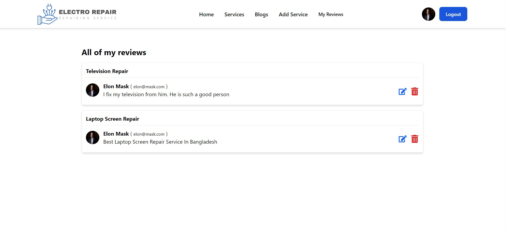

# <a href='https://electro-repair.web.app/'>Electro Repair</a>

### Live site Link: <a href='https://electro-repair.web.app/'>https://electro-repair.web.app/</a>

#### Electro Repair is a electronics repair service store. The technologies, which are used to build this website:

-  `React Js`
-  `React Router`
-  `Context API`
-  `Firebase Authentication`
-  `Tailwind CSS`
-  `Flowbite component library`
-  `Node Js`
-  `Express Js`
-  `MongoDB`

## Top Features:

-  `User See the service from service page`
-  `User can give a review in a specific service from service details page`
-  `User can edit or delete his or her review from my reviews page`
-  `User can create a account in our website`
-  `User can login into our website`
-  `User can login using their gmail or github account`

## Lets take a look at the main pages of our website:

### 1. Service Page:

### 2. Blogs Page:

### 3. Create New Service Page:

### 4. Users Review Page: `This is a private route`

### 5. Blog Details Page: `Here user can add comment if they logged in`

